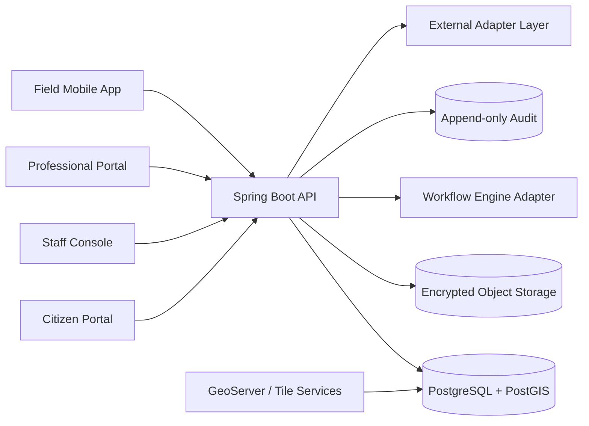

# Architecture Overview

## System Shape

The platform starts as a modular monolith plus independently scalable platform services.

## Trust Boundaries

- Public users can access only public projections and their own applications.
- Staff users require role, organization, jurisdiction, assignment, and workflow-state authorization.
- Platform administrators do not automatically receive legal-change authority.
- Registry-affecting operations require maker-checker approval and append-only audit.
- External systems interact through adapters with idempotency and data-minimized payloads.

## Module Boundaries

- `identity`: users, roles, permissions, organizations, sessions, professional verification.
- `administration`: configurable administrative geography.
- `parcels`: parcel identity, UPI, lifecycle, lineage, public projections.
- `cadastre`: geometry proposals, topology validation, approved geometry publication.
- `parties`: persons, organizations, representatives, estates, institutions.
- `rights`: ownership interests, leases, mortgages, easements, restrictions.
- `transactions`: applications and registry-affecting transaction orchestration.
- `workflow`: human tasks, approvals, deadlines, escalation abstractions.
- `documents`: metadata, versions, checksums, object-storage references.
- `payments`: invoices, callbacks, reconciliation, idempotency.
- `disputes`: disputes, court orders, restrictions, appeals.
- `audit`: immutable traceability events.
- `integrations`: sandbox/mock and authorized external connectors.

## Phase 1 Vertical Slice

Phase 1 creates the local development skeleton, schema layout, identity primitives, audit primitives, correlation IDs, security defaults, and portal shells.
